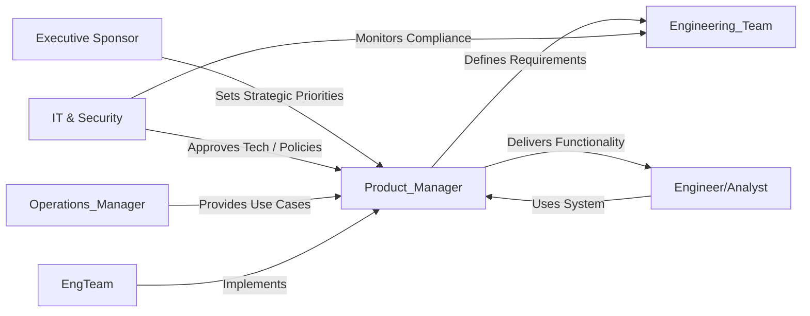
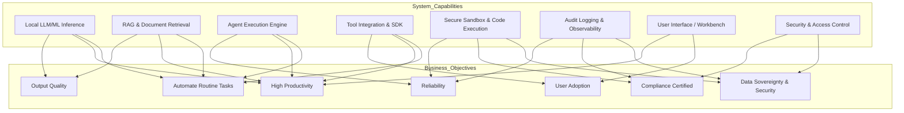
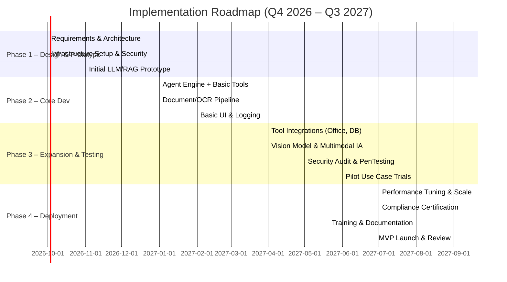

# Executive Summary  

The **Sovereign Agentic AI Workbench** is a next-generation on-premise AI platform designed for heavy industries (refineries, public utilities, defense) that handle **sensitive knowledge work**.  Its vision is to empower enterprise knowledge workers and developers to delegate complex, multi-step tasks to AI *agents* while ensuring **full data sovereignty**, security, and auditability.  Rather than a simple chat interface, this “decision workbench” maintains persistent business context and orchestrates AI models, tools, and multimodal inputs under strict governance.  

Key benefits include automating routine tasks (document summarization, report generation, code writing, diagram analysis, etc.) to boost productivity, while guaranteeing that **no sensitive data ever leaves the facility**.  The system relies on open-weight LLMs and vision models running locally, a secure sandbox for any generated code, and integrated toolchains (search, OCR, spreadsheets, presentation generators, etc.) under an agentic execution engine.  Strategic objectives are to **accelerate knowledge work** (e.g. 50–80% reduction in manual effort), **ensure 100% compliance with data residency and security requirements**, and **provide end-to-end auditability**.  KPIs will measure task automation rates, model accuracy, user adoption, and security incidents.  

The report below outlines the **product vision**, target customers and personas, prioritized business goals and KPIs, required core capabilities, representative use cases, regulatory and security constraints, risk mitigation strategies, a 6–12 month implementation roadmap (with a Gantt diagram), and an evaluation plan.  A table maps each business objective to supporting capabilities and success metrics.  The strategy aligns with industry best practices (NIST, ISO 27001, etc.) for secure, on-premise AI deployments.  

## Product Vision & Mission  

- **Vision:** *“Enable secure, sovereign AI-driven productivity for critical-industrial enterprises.”*  The workbench is positioned as an **enterprise AI decision platform** (or “workbench”) that goes beyond one-shot chat by **maintaining business state, verifying actions, and fully governing AI agents**.  
- **Mission:** Empower knowledge workers, engineers, and analysts in regulated industries to **delegate complex tasks to autonomous AI agents** without compromising confidentiality.  This includes processing classified documents, engineering drawings, inspection reports, and generating trusted business artifacts *all within the on-prem environment*.  In practice this means integrating local AI models (large language and vision models) with company data and tools, under strict security controls and transparency.  
- **Core User Problems:**  Enterprises in heavy industry and defense generate vast amounts of **routine but sensitive** documents and data (e.g. approval notes, SOPs, technical manuals, inspection images).  Currently, workers spend substantial time reading, summarizing, and drafting documents or code in isolated workflows.  Existing AI services (cloud-based or chatbots) are not feasible due to data sovereignty and security.  Users need **trusted, reliable AI assistants** that can handle multi-turn workflows (planning, tool use, verification) on-premises.  

The workbench’s value proposition is thus to **automate knowledge workflows** (like summarizing manuals, drafting presentations, extracting data from diagrams, generating code snippets, etc.) under a governance model that provides **auditable chains of reasoning and strict access control**.  This aligns with emerging industry thinking that enterprise AI should focus on “delegated outcomes” and maintained state rather than ephemeral chat sessions.  

## Target Customers & Stakeholders  

**Industries:**  Refining, petrochemicals, power, utilities, defense manufacturing, government agencies – any domain with highly regulated, confidential data and complex knowledge work.  

**Primary Stakeholders:**  
- **Business/Operations Managers:** Seek higher productivity and faster decision-making from knowledge teams.  Concerned with efficiency, error reduction, and regulatory compliance.  
- **Knowledge Workers / Engineers / Analysts:** The end-users who will use AI assistants to process manuals, reports, diagrams, and generate documents or code.  They need intuitive interfaces that respect domain expertise and terminology.  
- **IT/Security Team:** Responsible for infrastructure, data protection, and compliance (e.g. ISO 27001, NIST, industrial standards).  They enforce on-premises deployment, network isolation, user authentication, and auditing.  
- **AI Developers / Data Scientists:** Set up the platform, manage models, ingestion pipelines, and agent configurations.  They integrate enterprise data sources (documents, databases, images) and maintain the AI systems.  
- **Executive Sponsors / Compliance Officers:** Ensure the solution meets strategic goals (cost savings, innovation) and legal/regulatory requirements (data sovereignty, export controls, industry-specific regulations).  

A simplified stakeholder map:  

## Primary User Personas & Jobs-to-be-Done  

We identify three representative user personas (with example tasks):  

- **Industrial Engineer / Technical Expert:**  A field engineer or technical specialist who needs to interpret schematics, safety manuals, and past incident reports. *Jobs:* Quickly summarize lengthy technical documents; extract key parameters from process diagrams; generate maintenance schedules.  Example: “Summarize the latest inspection reports and highlight any critical issues needing review.”  

- **Safety/Compliance Officer:** Responsible for regulatory documentation, audit trails, and risk assessments. *Jobs:* Compile audit reports from raw data; verify that procedures and reports meet standards; generate compliance presentations.  Example: “Draft a compliance briefing based on the latest operations logs and incident logs, including references to relevant SOPs.”  

- **Knowledge-Worker / Administrator:** Prepares board presentations, approval notes, or code snippets for internal tools. *Jobs:* Draft policy documents or briefings; automate routine report writing; generate slides and spreadsheets from data; author and test small automation scripts.  Example: “Create a quarterly status report from raw KPIs and logs, and auto-generate a PowerPoint deck.”  

(Other personas might include **Data Scientist** setting up RAG pipelines, and **IT Admin** managing the infrastructure, but these are more implementation roles.)  

Each persona’s jobs-to-be-done revolve around **processing existing knowledge assets** (PDFs, databases, images, code repositories) and **producing structured outputs** (reports, docs, code) efficiently and accurately, without exposing sensitive content.

## Key Use Cases & Workflows  

Representative scenarios (end-to-end flows) include:  

1. **Document Summarization & Action Item Extraction:** An engineer uploads a set of scanned inspection reports (PDF/images). The agent applies OCR and NLP to extract observations, then generates a summarized text report highlighting critical maintenance tasks.  

2. **Procedure Translation & Compliance Check:** A compliance officer inputs the latest safety SOP (document). The workbench’s vision-language model identifies all action steps and automatically cross-references against regulatory guidelines. It flags any inconsistencies and generates a revised SOP draft.  

3. **Technical Diagram Analysis:** A maintenance tech takes a photo of a pipeline P&ID (engineering drawing). The multimodal AI interprets symbols, maps them to process components, and answers questions (e.g. “What valves should be closed during shutdown?”).  

4. **Automated Report Generation:** An operations manager needs a weekly report. The agent queries local databases (through RAG) for production metrics and incidents, then composes a report in Word and a summary slide deck.  

5. **Code Assistant in Sandbox:** A developer requests an automation script (Python) to process log files. The LLM agent writes code and runs unit tests in a secure sandbox. The system verifies results and only outputs safe, tested code.  

6. **Multi-Stage Analysis (Agent Workflow):** A complex inquiry (e.g. “Investigate a recent equipment failure.”) triggers the agent to (a) retrieve relevant history from knowledge base (RAG), (b) summarize findings, (c) propose a diagnostic plan (tools usage), (d) execute intermediate steps (like data parsing), (e) present a final report. Human in loop reviews at key points.  

7. **Email/Chat Interface to Knowledge:** An engineer asks the system (via internal chat UI): “What were common safety violations last quarter?” The agent fetches data from logs and documents, then synthesizes an answer with references.  

8. **Presentation Prep:** The marketing team needs an internal overview presentation. They input bullet points, and the agent creates a professional PowerPoint with diagrams and speaker notes, pulling images from on-prem repositories.  

Each use case combines **multimodal input** (text, images, code), **retrieval of internal knowledge**, and **agentic planning** with verification. All outputs (documents, presentations, code) are expected to be production-ready, auditable, and delivered under strict access control.

## Business Objectives & KPIs  

The workbench’s goals are both **strategic** (enable new capabilities, compliance) and **tactical** (efficiency gains, adoption). We prioritize these 10 objectives (with sample KPIs):  

1. **Automate Routine Knowledge Tasks:** Reduce manual processing time by X%.  *KPI:* Task automation rate (e.g. % of reports auto-generated). *Target:* ≥50% reduction in time per task.  

2. **Ensure Data Sovereignty and Security:** No sensitive data leaves premises. *KPI:* 0 external data transmissions (validated by audits); compliance with ISO 27001/NIST. *Target:* 100% on-prem retention (monitored).  

3. **Enhance Productivity:** Increase worker productivity. *KPI:* Number of tasks completed per week per user; average throughput. *Target:* +30–50% task throughput.  

4. **Accurate and Trustworthy Outputs:** Maintain high AI output quality. *KPI:* Accuracy of summaries/answers (precision/recall vs. benchmarks); human-verification rate. *Target:* ≥90% of AI-generated outputs pass expert review.  

5. **Agent Reliability:** Ensure agents run smoothly. *KPI:* Task success rate; system uptime. *Target:* ≥99% availability, ≥95% successful task completion.  

6. **User Adoption:** High usage by target personas. *KPI:* Active users per month; number of sessions. *Target:* Onboard ≥70% of pilot user base within 6 months.  

7. **Regulatory Compliance:** Meet industry standards (e.g. NERC, IEC 62443, ISO 27001). *KPI:* Audit findings; certification achieved. *Target:* 0 compliance violations; attain relevant certifications.  

8. **Operational Efficiency:** Optimize costs/resources. *KPI:* CPU/GPU utilization; cost per task. *Target:* Task latency ≤Y seconds; GPU usage under 80%.  

9. **Scalability and Performance:** Handle growing data and queries. *KPI:* Query latency; throughput vs. data volume. *Target:* Scale to N concurrent users with <2s response time.  

10. **Innovation Enablement:** Accelerate AI-driven innovation. *KPI:* Number of new AI-driven workflows implemented; time to prototype new use case. *Target:* Support 5 new use cases in year one.  

### Objectives → Capabilities → KPIs Mapping  

| **Business Objective**                                  | **Core Capability Enabler**                                        | **KPI (Target)**                             |
|---------------------------------------------------------|-------------------------------------------------------------------|----------------------------------------------|
| Automate routine knowledge tasks (↑ productivity)        | RAG-based retrieval; Document OCR & understanding; Summarization; Agent planning | % tasks automated (≥50%); time saved/sample task |
| Ensure data sovereignty & security                      | On-prem LLM deployment; Air-gap enforcement; Audit logs; Access control | 0 data leaks; ISO 27001/NIST controls met     |
| Enhance productivity (↑ tasks/person)                   | Multimodal LLMs (text+vision); Parallel agents; Auto-document generation (Word/PPT/Excel) | Documents generated per week; user sessions ↑30% |
| High output quality (accuracy)                          | Large local LLMs; Reranking/verification loops; Human-in-loop checkpoints | AI output accuracy ≥90%; human review rate ≤10% |
| Agent reliability & availability                        | Robust runtime; Sandboxed execution; Monitoring/health checks        | 99% uptime; 95% task success rate           |
| High user adoption & satisfaction                       | Intuitive UI/UX; Persona-specific workbench views; Training & support | Active user growth ≥70%; user satisfaction surveys ≥4/5 |
| Regulatory compliance (ISO/NIST/Industry standards)     | Encrypted storage; Policy engine; Audit trail; Static analysis of code; Identity management | 0 compliance violations; relevant certifications obtained |
| Operational efficiency (cost/performance)               | Model quantization/optimization; Resource manager; Load balancing    | Latency ≤2s (queries); GPU usage <80%; cost savings %) |
| Scalability & performance                                | Modular architecture; Kubernetes/container deployment; Caching/Retrieval index | Handles N concurrent agents; throughput benchmarks met |
| Innovation enablement (new use cases)                   | Extensible toolkit (API/SDK); Plugin framework for new tools/models   | # of pilots launched; time-to-market for features |

This table links each objective to the system capabilities that enable it, and defines measurable KPIs.  For example, achieving **“Automate routine knowledge tasks”** requires robust document ingestion (OCR/IDP) and summarization agents; success is measured by the percentage of routine tasks the system can handle autonomously.

## Core Capabilities Required  

To meet the above objectives, the workbench must provide:  

- **Local Multi-Model LLM/ML Inference:** Hosting of open-weight LLMs and vision models on-premise (quantized for efficiency) to handle text and image inputs.  Includes model management (hot-swapping, versioning) and inference optimization.  
- **Retrieval-Augmented Generation (RAG) & Knowledge Base:** Secure document store and vector search over enterprise data (manuals, SOPs, reports).  Semantic search and context retrieval ensure grounding of answers.  Includes OCR pipelines for scanned docs and image understanding (vision-language).  
- **Agentic Execution Engine:** An orchestration framework that enables agents to plan, call tools (APIs, scripts, databases), and iterate with human oversight.  Must support multi-step workflows with state tracking and memory.  (E.g. open-source frameworks like LangGraph or custom agents.)  
- **Tool Integration & SDK:** Built-in connectors for key enterprise tools (document editors, spreadsheets, code repos, calendars, messaging) and ability to add new tools.  This allows agents to automate outputs (e.g., generate Excel from data, send emails, push to Git).  
- **Secure Sandbox for Code/Tools:** Any code or formulas generated by agents must be executed in a constrained sandbox (container or VM) to prevent malicious actions.  No direct external network; strict permission model (least privilege) for tools.  
- **User Interface / Decision Workbench:** A persona-aware UI that presents AI recommendations, evidence, and actions.  E.g., an engineer’s dashboard vs. an admin’s console.  Supports query input, reviewing intermediate steps, and final artifacts.  
- **Auditability & Observability:** Comprehensive logging of agent decisions, queries, data accessed, and actions taken.  Tamper-evident audit trails and reporting (to satisfy compliance audits).  Integration of monitoring (e.g., using OpenTelemetry) to track system health and usage.  
- **Security & Access Control:** Role-based authentication, encrypted data-at-rest and in-transit (within LAN), strict egress filtering (“air-gap” enforcement).  Compliance with ISO 27001 controls and industrial standards (e.g. IEC 62443) is essential.  The platform should also include data provenance and clear consent/usage policies.  

Each capability is aligned to one or more business objectives. For instance, **”Secure Sandbox”** and **”Access Control”** directly serve the sovereignty and compliance objectives, while **”Retrieval-Driven AI”** and **”RAG Knowledge Base”** serve productivity and accuracy objectives.

*Figure: Mapping of system capabilities to business objectives (simplified). For example, on-prem inference (C1) and RAG (C2) support automation and productivity, while sandboxing (C5) and logging (C6) underpin sovereignty and compliance.*

## Regulatory, Compliance & Security Constraints  

Because this platform targets critical industries, the following constraints apply:  

- **Air-Gapped Deployment:** The system must operate with **zero external network connectivity** (no cloud or internet).  Strict egress controls (firewall, data diode) are required.  NIST notes that traditional “air-gap” is often not enough alone, so additionally network activity must be monitored (e.g. eBPF/tcpdump) to verify no unintended leakage.  
- **Data Sovereignty and Residency:** All data (inputs, AI models, outputs) must remain on-premises. Encryption keys are managed internally. This aligns with guidance that in AI, “bringing AI to the data” is key to sovereignty.  
- **Industry Standards Compliance:** The solution must adhere to relevant frameworks: e.g. **ISO/IEC 27001** (information security management), **NIST CSF** (cybersecurity framework), and sector-specific standards (e.g. **ISA/IEC 62443** for industrial control system security).  Export control laws (ITAR, EAR) may also influence permissible AI models or hardware.  
- **Privacy & Governance:** Even on-prem, user data and queries should follow privacy principles (e.g. anonymization of PII in logs). Data governance policies must be enforced across the AI lifecycle (data ingestion, model training/inference, logging).  
- **Security Hardening:** All components (OS, containers, ML frameworks) must be secured (patched, minimal services). Agents must resist adversarial inputs; techniques like prompt filtering and model input validation are needed to prevent injection attacks. Least-privilege permission models for tools and rigorous code sandboxing are mandatory.  
- **Audit and Traceability:** For compliance audits, the system must provide evidence that no policies were violated. Every agent action (e.g. which tool called, what data queried) must be logged with timestamps and user identity.  

Meeting these constraints not only avoids non-compliance penalties but also builds user trust (“sovereignty” implies trust through verifiable control).  

## Strategic Risks & Mitigation  

1. **Model Limitations / Output Hallucination:** Locally hosted models may produce incorrect results or bias. *Mitigation:* Use RAG with up-to-date enterprise documents to ground answers; implement human-in-loop verification for critical outputs; continuously fine-tune models on domain data. Include a confidence-scoring and feedback loop.  

2. **Security Vulnerabilities:** An advanced agent with tool access could potentially breach controls (e.g. by malicious code). *Mitigation:* Enforce strict sandboxing for all code execution. Apply static analysis to generated code. Regularly pen-test the system and use intrusion detection. Follow NIST agent security guidance on authentication and governance of agent identities.  

3. **Data Leakage:** Despite air-gapping, risk of inadvertent leaks (e.g. via removable media). *Mitigation:* No removable media on system; DLP measures; mandatory training on data handling. Establish automatic checks that flag any attempted data export.  

4. **User Resistance / Low Adoption:** Users may distrust or misuse AI. *Mitigation:* Provide early training and involve power-users in design. Start with high-impact pilot tasks. Keep the interface transparent (show sources, plans) to build confidence. Collect user feedback to iteratively improve UX.  

5. **Regulatory Change:** Future regulations may impose new requirements. *Mitigation:* Adopt a modular design so policies can be updated. Monitor standards (e.g. NIST AI Risk Management Framework) and plan for re-certification cycles.  

6. **Project Overreach:** The scope (multimodal AI, agents, full governance) is broad. *Mitigation:* Phase the rollout (see roadmap below). Prioritize core functionality first (text-based QA and generation) before adding vision or complex tools.  

By anticipating these risks and building in controls early, the project can navigate the critical infrastructure environment effectively.  

## Implementation Roadmap (6–12 Month Plan)  

Phased timeline (starting Oct 2026) with milestones:  

- **Phase 1 (Oct–Dec 2026): Planning & Prototyping**  
  - Finalize requirements, architecture design, and stakeholder alignment.  
  - Set up secure on-prem hardware (servers, GPUs) and network isolation.  
  - Integrate initial LLM and vector DB prototypes; simple RAG demo with sanitized data.  
  - Develop core security baseline (firewall, auth, encryption).  
  - *Milestone:* Prototype that ingests documents and answers queries in isolated environment.  

- **Phase 2 (Jan–Mar 2027): Core Feature Development**  
  - Build the agent execution engine (open-source or custom) with basic tool API (e.g. file I/O, shell execution in sandbox).  
  - Implement document processing pipeline: OCR, parsing, vector indexing of corpora.  
  - Integrate at least one local vision-language model (for images/diagrams).  
  - Create initial UI/workbench for engineers to query and see results.  
  - Add audit logging framework (record queries, agent actions).  
  - *Milestone:* End-to-end flow for a simple use case (e.g. “ask a question to the system and get an auto-generated report”).  

- **Phase 3 (Apr–Jun 2027): Expansion & Testing**  
  - Expand tool integrations (Word/PPT/Excel generation libraries, database connectors, email).  
  - Optimize model performance (quantization, caching).  
  - Conduct security testing: vulnerability scans, simulate data exfil attempts.  
  - Onboard pilot users and gather feedback; refine UI/UX.  
  - Develop real-world pilot use cases (select 2–3 scenarios like those above) and test them.  
  - *Milestone:* Pilot deployment for a select team, achieving initial KPIs (e.g. one document per user per week automated).  

- **Phase 4 (Jul–Sep 2027): Hardening & Deployment**  
  - Incorporate feedback; improve multi-agent workflows (e.g. allow multi-step plans with human review).  
  - Prepare documentation, training, and operations plan.  
  - Engage with auditors for compliance review.  
  - Scale up dataset indexing, improve performance tuning.  
  - *Milestone:* Official launch of MVP with metrics dashboard; initial user training complete.  

*Figure: High-level Gantt chart of development phases (each bar spans months). Shaded tasks indicate concurrent workstreams.*

## Success Evaluation Plan  

To evaluate success and drive continuous improvement, we will use a combination of quantitative benchmarks and pilot testing:  

- **Functional Benchmarks:** Define standard test tasks (e.g. summarizing a set of documents, answering domain-specific questions, generating a report) and measure accuracy and speed. Compare against human performance baselines. Tools like AI evaluation suites (LangEval, GPT-4all) can test LLM outputs for correctness and coherence.  

- **Performance Metrics:** Continuously measure system KPIs: query latency, throughput, resource usage, and system uptime. Aim for targets defined above (e.g. 95th percentile latency <2s).  

- **User Feedback and Adoption:** Conduct usability studies and surveys with pilot users to assess satisfaction, trust, and any unmet needs. Track adoption metrics (active users, number of sessions, tasks delegated).  

- **Security/Audit Tests:** Regularly run penetration tests and compliance audits. Verify that no policy violations occur (e.g. attempted external calls are blocked). Use canary tests: e.g. try to induce an agent to leak data and ensure sandbox blocks it.  

- **Outcome Evaluation:** For each business objective, define target improvement. For example, if “Automate tasks” target is 50% time saving, measure actual task completion times and volumes pre- and post-deployment. Report ROI for the business (time saved, error reduction, etc.).  

- **AI Evaluation Metrics:** Where possible, use established metrics: RAG “groundedness” (ratio of answers supported by retrieved context), hallucination rate, BLEU/ROUGE for summarization quality, F1 score for info extraction tasks.  

By systematically measuring these, the team can demonstrate the workbench’s value and identify areas for further enhancement.

## Strategic Goals (Recap)  

- **Vision Statement (Concise):** *“A sovereign, on-premise AI workbench that lets industrial enterprises securely delegate knowledge work to autonomous AI agents.”*  
- **Mission (Concise):** *Enable regulated organizations to safely harness AI for productivity, by providing a fully auditable, on-premises AI agent platform that respects all compliance and security constraints.*  

**Prioritized Business Goals:**  (1) *Accelerate document processing and knowledge work* (target: 50–80% time reduction, measure via task completion rate); (2) *Guarantee data sovereignty* (target: 0 external data egress, compliance audit passed); (3) *Ensure enterprise-grade security and compliance* (target: achieve relevant certifications, zero incidents); (4) *Drive adoption among target users* (target: >70% user uptake in pilot); (5) *Deliver high-quality outputs* (target: ≥90% accuracy).  

These are supported by the core capabilities and mapped to concrete KPIs in the table above.

**Sources:** Product requirements and context are drawn from the provided PRD (Smart India Hackathon reference).  Security and compliance guidelines follow NIST and industry standards.